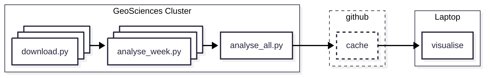

# Hazard Variation Index in SwarmPAL

This is a standalone [SwarmPAL][swarmpal] toolbox that implements the the [Hazard Variation Index][hvi_paper].

## Analysis with Slurm on HPC

Performing the HVI analysis over the 11 year period for which Swarm data is available
is computationaly expensive.
The [`slurm/`](slurm/) directory has scripts to download the data and perform the analysis
on HPC infrastructure hosted by the University of Edinburgh's School of GeoSciences.
The pipeline can be visualised with the following diagram:

## Licence

See [LICENCE](LICENCE)

[swarmpal]: https://github.com/Swarm-DISC/SwarmPAL
[hvi_paper]: https://doi.org/10.1051/swsc/2024033
